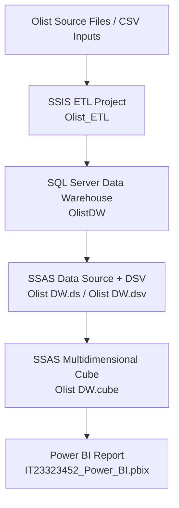

# Olist E-Commerce DWBI Solution

Enterprise-style Data Warehouse and Business Intelligence implementation for the Olist e-commerce dataset using Microsoft BI stack components:

- SQL Server Database Engine (Data Warehouse)
- SQL Server Integration Services (SSIS) for ETL
- SQL Server Analysis Services (SSAS Multidimensional) for OLAP cube modeling
- Power BI for reporting and dashboarding

## Table of Contents

- [Project Overview](#project-overview)
- [Solution Architecture](#solution-architecture)
- [Repository Structure](#repository-structure)
- [Data Model Summary](#data-model-summary)
- [Technology Stack](#technology-stack)
- [Prerequisites](#prerequisites)
- [Environment Configuration](#environment-configuration)
- [Build and Deployment Workflow](#build-and-deployment-workflow)
- [Power BI Integration](#power-bi-integration)
- [Validation Checklist](#validation-checklist)
- [Troubleshooting](#troubleshooting)
- [Known Limitations](#known-limitations)
- [Future Enhancements](#future-enhancements)
- [Artifacts and Deliverables](#artifacts-and-deliverables)

## Project Overview

This project implements an end-to-end DWBI pipeline for Olist marketplace analytics.

The solution follows a layered analytical architecture:

1. Source ingestion and transformation using SSIS packages.
2. Centralized star-schema-oriented warehouse in SQL Server.
3. Multidimensional semantic layer in SSAS for fast slicing and dicing.
4. Executive dashboards and interactive analytics in Power BI.

Primary analytical focus areas include:

- Sales trend analysis
- Product/category performance
- Geographic customer segmentation
- Logistics and delivery performance

## Solution Architecture



## Repository Structure

```text
Olist-Ecommerce-DWBI-Solution/
  CubeProject_IT23323452/
    Olist_ETL/
      Olist_ETL.slnx
      Olist_ETL/
        Olist_ETL.dtproj
        Package.dtsx
        Project.params
    OlistCubeProject/
      OlistCubeProject.slnx
      OlistCubeProject/
        OlistCubeProject.dwproj
        Olist DW.cube
        Olist DW.ds
        Olist DW.dsv
        Olist DW.partitions
        Dim Customer.dim
        Dim Date.dim
        Dim Product.dim
        Fact Sales.dim
  DataWarehouse_IT23323452/
    OlistDW.bak
  PowerBIReports_IT3323452/
    IT23323452_Power_BI.pbix
  Document_IT23323452/
    Document_IT23323452.pdf
  SS/
    (implementation screenshots)
```

## Data Model Summary

Based on the cube metadata currently in the repository:

- Cube: `Olist DW`
- Measure Group: `Fact Sales`
- Dimensions:
  - `Dim Date`
  - `Dim Product`
  - `Dim Customer`
  - `Fact Sales` (degenerate/technical support dimension)

### Example Measures in Fact Sales

- Quantity
- Price
- Freight Value
- Total Sales
- Days To Approve
- Days To Deliver
- Fact Sales Count

### Time Hierarchy

`Dim Date` includes standard attributes such as Year, Quarter, Month, and Day for period-over-period analysis.

## Technology Stack

- SQL Server (Database Engine)
- SSIS Project Deployment Model
- SSAS Multidimensional (Cube)
- Visual Studio with SQL Server Data Tools (SSDT)
- Power BI Desktop

## Prerequisites

Install the following before running the solution:

1. SQL Server 2019 or later (Database Engine)
2. SQL Server Analysis Services (Multidimensional mode)
3. SQL Server Integration Services
4. Visual Studio 2022 with SSDT extensions:
   - Integration Services extension
   - Analysis Services extension
5. SQL Server Management Studio (recommended)
6. Power BI Desktop (latest stable)

## Environment Configuration

### 1. Restore the Data Warehouse

- Open SSMS and restore backup from:
  - `DataWarehouse_IT23323452/OlistDW.bak`
- Restore target database name:
  - `OlistDW`

### 2. Update Connection Strings

Project files currently contain machine-specific references (for example, local server and local CSV paths). Update these after cloning:

- SSIS connection managers and package parameters in `Project.params` and `Package.dtsx`
- SSAS data source connection in `Olist DW.ds`
- Deployment configuration mapping in `OlistCubeProject.dwproj`

### 3. Verify Source Data Paths

The SSIS project includes flat file references to local CSV locations. Ensure those paths exist on your machine or repoint to your own dataset folder.

## Build and Deployment Workflow

### Step A: ETL Deployment and Execution (SSIS)

1. Open `CubeProject_IT23323452/Olist_ETL/Olist_ETL.slnx` in Visual Studio.
2. Build the SSIS project (`Olist_ETL.dtproj`).
3. Publish the project to SSIS Catalog (SSISDB) or execute locally for development.
4. Run `Package.dtsx` and validate row counts and task success.

Expected artifact after successful build:

- `Olist_ETL.ispac` (generated under build output)

### Step B: Cube Deployment and Processing (SSAS)

1. Open `CubeProject_IT23323452/OlistCubeProject/OlistCubeProject.slnx`.
2. Build the Analysis Services project (`OlistCubeProject.dwproj`).
3. Deploy to your SSAS Multidimensional instance.
4. Process:
   - Dimensions
   - Measure group partitions
   - Full cube (`Olist DW`)
5. Validate cube browser queries (for example: total sales by year and category).

Expected artifacts after successful build:

- `.asdatabase`
- `.deploymentoptions`
- `.deploymenttargets`

## Power BI Integration

1. Open `PowerBIReports_IT3323452/IT23323452_Power_BI.pbix` in Power BI Desktop.
2. Rebind data source credentials or server endpoints if prompted.
3. Refresh all datasets.
4. Validate measures and visuals against SSAS or DW aggregates.
5. Publish to Power BI Service if required by your submission workflow.

## Validation Checklist

Use this quick checklist after deployment:

- [ ] SQL database `OlistDW` restored and accessible
- [ ] SSIS package runs without failures
- [ ] Fact and dimension tables populated as expected
- [ ] SSAS project deploys successfully
- [ ] Cube processing completes with no key errors
- [ ] Measures return expected totals
- [ ] Power BI report refresh succeeds
- [ ] Dashboard values reconcile with warehouse totals

## Troubleshooting

### SSIS package fails at Flat File Source

- Cause: incorrect local CSV path or code page mismatch.
- Fix: update connection manager paths and file locale/code page settings.

### SSAS deployment fails

- Cause: wrong server name or insufficient permissions.
- Fix: verify target server in deployment properties and grant deployment rights.

### Cube processing key errors

- Cause: orphaned foreign keys between fact and dimensions.
- Fix: inspect ETL load order and surrogate key mappings.

### Power BI refresh error

- Cause: stale credentials or changed connection endpoint.
- Fix: update data source settings and re-authenticate.

## Known Limitations

- Environment-specific hardcoded paths and instance names are present in project metadata.
- No automated CI/CD pipeline for SSIS/SSAS deployment.
- No parameterized environment profiles (Dev/UAT/Prod) committed yet.

## Future Enhancements

- Externalize all source and server paths to environment parameters.
- Add SQL validation scripts for row-count and reconciliation checks.
- Add automated deployment using Azure DevOps or GitHub Actions self-hosted runner.
- Introduce incremental processing strategy for SSAS partitions.
- Add data quality scorecards to Power BI.

## Artifacts and Deliverables

- ETL solution: `CubeProject_IT23323452/Olist_ETL`
- Cube solution: `CubeProject_IT23323452/OlistCubeProject`
- Warehouse backup: `DataWarehouse_IT23323452/OlistDW.bak`
- Power BI report: `PowerBIReports_IT3323452/IT23323452_Power_BI.pbix`
- Project document: `Document_IT23323452/Document_IT23323452.pdf`
- Screenshots: `SS/`

## Author Notes

This repository appears to be an academic DWBI implementation package. If you plan to productionize it, prioritize parameterization, secure secret management, deployment automation, and data quality monitoring.
