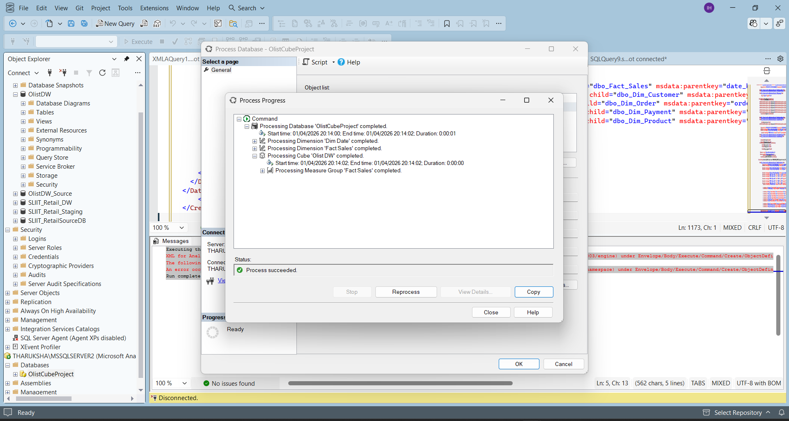
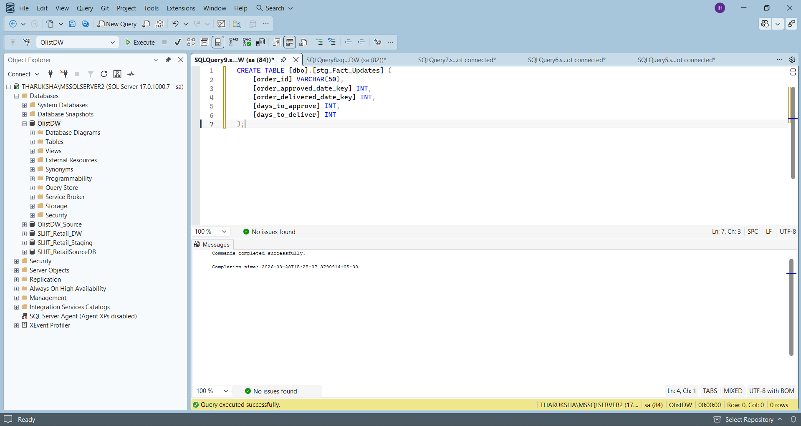
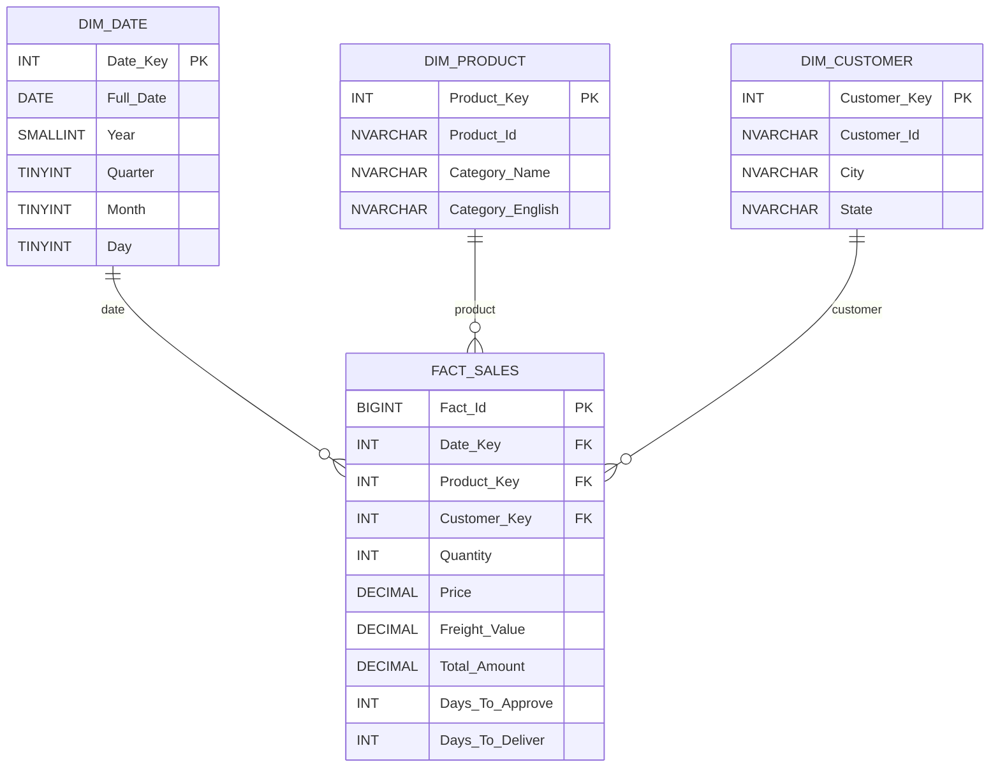
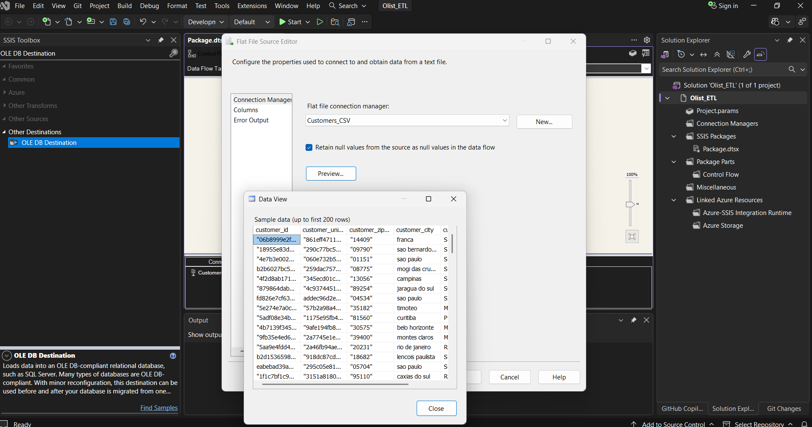
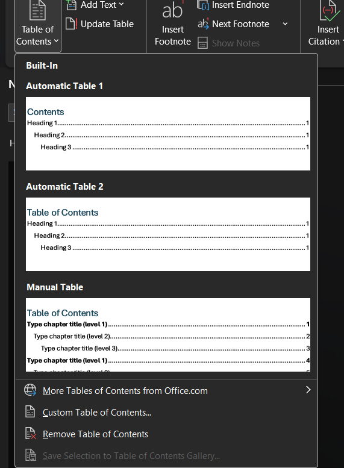
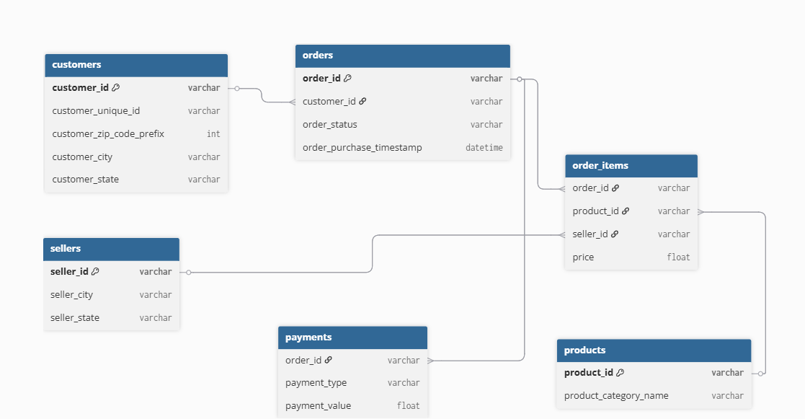

<div align="center">

# 🏪 Olist E-Commerce — Data Warehouse & Business Intelligence Solution

<br>

[](https://www.microsoft.com/en-us/sql-server)
[](https://docs.microsoft.com/en-us/sql/integration-services/)
[](https://docs.microsoft.com/en-us/analysis-services/)
[](https://powerbi.microsoft.com/)

<br>

**An enterprise-grade Data Warehouse and Business Intelligence solution** built on the **Brazilian Olist e-commerce marketplace dataset**, leveraging the full **Microsoft BI Stack** to deliver actionable insights through interactive dashboards and multidimensional analytics.

<br>



<br><br>

[📋 Overview](#-project-overview) •
[🏗️ Architecture](#%EF%B8%8F-solution-architecture) •
[📁 Repository](#-repository-structure) •
[⚙️ Setup](#%EF%B8%8F-getting-started) •
[📊 Data Model](#-data-model) •
[🔧 Troubleshooting](#-troubleshooting)

<br>

</div>

---

## 📋 Project Overview

This project implements a **complete end-to-end DWBI pipeline** for the Olist marketplace — from raw CSV ingestion to executive-ready interactive dashboards. The solution follows industry best practices with a **layered analytical architecture**:

| Layer | Component | Description |
|:---:|:---|:---|
| **1** | 🔄 **ETL Pipeline** | Source ingestion & transformation using SSIS packages |
| **2** | 🏗️ **Data Warehouse** | Centralized star-schema warehouse in SQL Server |
| **3** | 🧊 **OLAP Cube** | Multidimensional semantic layer in SSAS for fast slicing & dicing |
| **4** | 📊 **Dashboards** | Executive dashboards & interactive analytics in Power BI |

### 🎯 Analytical Focus Areas

<table>
<tr>
<td width="25%" align="center">

📈 **Sales Trends**<br>
<sub>Revenue patterns, seasonal analysis, growth metrics</sub>

</td>
<td width="25%" align="center">

📦 **Product Performance**<br>
<sub>Category rankings, pricing analysis, demand patterns</sub>

</td>
<td width="25%" align="center">

🌍 **Geographic Insights**<br>
<sub>Customer segmentation, regional distribution, market penetration</sub>

</td>
<td width="25%" align="center">

🚚 **Logistics & Delivery**<br>
<sub>Delivery SLAs, approval cycles, fulfillment efficiency</sub>

</td>
</tr>
</table>

---

## 🏗️ Solution Architecture


### 🔗 Source Entity Relationship Diagram

<div align="center">

</div>

---

## 📁 Repository Structure

```
📦 Olist-Ecommerce-DWBI-Solution
│
├── 📂 CubeProject_IT23323452/            # Visual Studio Solution Files
│   ├── 📂 Olist_ETL/                     # SSIS ETL Project
│   │   ├── Olist_ETL.slnx                #   └── Solution file
│   │   └── Olist_ETL/
│   │       ├── Olist_ETL.dtproj          #       ├── SSIS project definition
│   │       ├── Package.dtsx              #       ├── Main ETL package
│   │       └── Project.params            #       └── Project parameters
│   │
│   └── 📂 OlistCubeProject/              # SSAS Cube Project
│       ├── OlistCubeProject.slnx         #   └── Solution file
│       └── OlistCubeProject/
│           ├── OlistCubeProject.dwproj   #       ├── SSAS project definition
│           ├── Olist DW.cube             #       ├── Cube definition
│           ├── Olist DW.ds               #       ├── Data source
│           ├── Olist DW.dsv              #       ├── Data source view
│           ├── Olist DW.partitions       #       ├── Partition definitions
│           ├── Dim Customer.dim          #       ├── Customer dimension
│           ├── Dim Date.dim              #       ├── Date dimension
│           ├── Dim Product.dim           #       ├── Product dimension
│           └── Fact Sales.dim            #       └── Fact sales (degenerate dim)
│
├── 📂 SQL Scripts/                        # DDL Scripts
│   ├── Create_DW.sql                     #   ├── Database & schema creation
│   ├── Dimension_Tables.sql              #   ├── Dimension table DDL
│   └── Fact_Sales.sql                    #   └── Fact table DDL with indexes
│
├── 📂 SSIS Package/                       # Standalone ETL Package
│   └── OlistDW_ETL.dtsx                  #   └── Full ETL package
│
├── 📂 SSAS Cube/                          # Standalone Cube Project Files
│   └── Cube Project Files/
│
├── 📂 DataWarehouse_IT23323452/           # Database Backup
│   └── OlistDW.bak                       #   └── SQL Server backup (~104 MB)
│
├── 📂 Power BI/                           # Power BI Reports
│   └── OlistDashboard.pbix               #   └── Main dashboard report
│
├── 📂 PowerBIReports_IT3323452/           # Additional Power BI Reports
│   └── IT23323452_Power_BI.pbix          #   └── Submission report
│
├── 📂 Screenshots/                        # Architecture & UI Screenshots
│   ├── Architecture.png
│   ├── Cube.png
│   ├── Dashboard.png
│   ├── ETLFlow.png
│   └── StarSchema.png
│
├── 📂 Documentation/                      # Project Documentation
│   └── Project_Report.pdf                #   └── Full project report
│
├── 📂 SS/                                 # Implementation Screenshots
│   └── (101 implementation screenshots)
│
├── .gitignore
└── README.md
```

---

## 📊 Data Model

### Star Schema Design

The data warehouse follows a **classic star schema** optimized for analytical queries:

<div align="center">

</div>

<br>



### 📐 Cube Measures & Dimensions

<table>
<tr>
<td width="50%">

#### 🧊 SSAS Cube: `Olist DW`

| Measure | Aggregation | Description |
|:---|:---:|:---|
| `Quantity` | SUM | Order item count |
| `Price` | SUM | Product revenue |
| `Freight Value` | SUM | Shipping costs |
| `Total Sales` | SUM | Price + Freight |
| `Days To Approve` | AVG | Approval latency |
| `Days To Deliver` | AVG | Delivery latency |
| `Fact Sales Count` | COUNT | Transaction count |

</td>
<td width="50%">

#### 📏 Dimensions & Hierarchies

| Dimension | Key Attributes | Hierarchy |
|:---|:---|:---|
| `Dim Date` | Year, Quarter, Month, Day | Year → Quarter → Month → Day |
| `Dim Product` | Product ID, Category (EN/PT) | Category → Product |
| `Dim Customer` | Customer ID, City, State | State → City → Customer |
| `Fact Sales` | *(degenerate)* | — |

</td>
</tr>
</table>

---

## ⚙️ Getting Started

### Prerequisites

> [!IMPORTANT]
> All components listed below must be installed before setting up the solution.

| # | Requirement | Version | Purpose |
|:---:|:---|:---:|:---|
| 1 | **SQL Server** (Database Engine) | 2019+ | Data Warehouse hosting |
| 2 | **SQL Server Analysis Services** | Multidimensional mode | OLAP Cube processing |
| 3 | **SQL Server Integration Services** | — | ETL package execution |
| 4 | **Visual Studio 2022** + SSDT | Latest | Project development & deployment |
| 5 | **SQL Server Management Studio** | 19+ | Database administration |
| 6 | **Power BI Desktop** | Latest stable | Dashboard viewing & publishing |

#### Required Visual Studio Extensions
- ✅ SQL Server Integration Services Projects
- ✅ SQL Server Analysis Services Projects

---

### 🚀 Setup & Deployment

<details>
<summary><b>Step 1 — Restore the Data Warehouse</b></summary>
<br>

1. Open **SQL Server Management Studio (SSMS)**
2. Connect to your SQL Server instance
3. Right-click **Databases** → **Restore Database...**
4. Select **Device** → Browse to:
   ```
   DataWarehouse_IT23323452/OlistDW.bak
   ```
5. Set target database name to: **`OlistDW`**
6. Click **OK** to restore

> [!TIP]
> Alternatively, you can run the SQL scripts in `SQL Scripts/` to create the schema from scratch:
> ```
> 1. Create_DW.sql         → Creates database & schemas (dw, stg)
> 2. Dimension_Tables.sql  → Creates Dim_Date, Dim_Product, Dim_Customer
> 3. Fact_Sales.sql         → Creates Fact_Sales with FK constraints & indexes
> ```

</details>

<details>
<summary><b>Step 2 — Configure Connection Strings</b></summary>
<br>

> [!WARNING]
> Project files contain **machine-specific** server names and file paths. You **must** update these after cloning.

Update the following connection references:

| File | What to Update |
|:---|:---|
| `Project.params` | SSIS project parameters (server name, paths) |
| `Package.dtsx` | Flat file connection managers & OLE DB connections |
| `Olist DW.ds` | SSAS data source server & database reference |
| `OlistCubeProject.dwproj` | Deployment target server configuration |

</details>

<details>
<summary><b>Step 3 — Deploy & Execute SSIS ETL</b></summary>
<br>

1. Open `CubeProject_IT23323452/Olist_ETL/Olist_ETL.slnx` in **Visual Studio**
2. Build the project (`Olist_ETL.dtproj`)
3. Deploy to **SSIS Catalog (SSISDB)** or execute locally
4. Run **`Package.dtsx`** and validate:
   - ✅ All tasks show green (success)
   - ✅ Row counts match expected volumes
   - ✅ No truncation or conversion warnings

<div align="center">

<br><sub><i>SSIS Package — Flat File Source Configuration & Data Preview</i></sub>
</div>

**Build Output:** `Olist_ETL.ispac`

</details>

<details>
<summary><b>Step 4 — Deploy & Process SSAS Cube</b></summary>
<br>

1. Open `CubeProject_IT23323452/OlistCubeProject/OlistCubeProject.slnx`
2. Build the Analysis Services project
3. Deploy to your **SSAS Multidimensional** instance
4. Process in order:
   - 🔹 Dimensions (`Dim Date`, `Dim Product`, `Dim Customer`)
   - 🔹 Measure group partitions (`Fact Sales`)
   - 🔹 Full cube (`Olist DW`)
5. Validate cube browser queries:
   ```mdx
   SELECT [Measures].[Total Sales] ON COLUMNS,
          [Dim Date].[Year].Members ON ROWS
   FROM   [Olist DW]
   ```

<div align="center">

<br><sub><i>SSAS Cube Processing — All dimensions and measures processed successfully</i></sub>
</div>

**Build Outputs:** `.asdatabase` · `.deploymentoptions` · `.deploymenttargets`

</details>

<details>
<summary><b>Step 5 — Connect Power BI</b></summary>
<br>

1. Open `Power BI/OlistDashboard.pbix` in **Power BI Desktop**
2. Update data source credentials when prompted:
   - Server name → your local SQL Server / SSAS instance
3. Click **Refresh All** to pull latest data
4. Validate measures reconcile with warehouse aggregates
5. *(Optional)* Publish to **Power BI Service** for web access

</details>

---

### ✅ Validation Checklist

After completing all deployment steps, verify each item:

| # | Check | Status |
|:---:|:---|:---:|
| 1 | SQL database `OlistDW` restored and accessible | ⬜ |
| 2 | SSIS package executes without failures | ⬜ |
| 3 | Fact and dimension tables populated correctly | ⬜ |
| 4 | SSAS project deploys successfully | ⬜ |
| 5 | Cube processing completes with zero key errors | ⬜ |
| 6 | MDX queries return expected aggregates | ⬜ |
| 7 | Power BI report refresh succeeds | ⬜ |
| 8 | Dashboard values reconcile with warehouse totals | ⬜ |

---

## 🔧 Troubleshooting

<details>
<summary><b>🔴 SSIS package fails at Flat File Source</b></summary>
<br>

| | Detail |
|:---|:---|
| **Cause** | Incorrect local CSV path or code page mismatch |
| **Fix** | Update connection manager paths and verify file locale/code page settings match your system encoding |

</details>

<details>
<summary><b>🔴 SSAS deployment fails</b></summary>
<br>

| | Detail |
|:---|:---|
| **Cause** | Wrong server name in deployment properties or insufficient permissions |
| **Fix** | Verify target server in project deployment properties and grant `db_owner` or Analysis Services admin rights |

</details>

<details>
<summary><b>🔴 Cube processing key errors</b></summary>
<br>

| | Detail |
|:---|:---|
| **Cause** | Orphaned foreign keys between fact and dimension tables |
| **Fix** | Inspect ETL load order — dimensions must be loaded before facts. Verify surrogate key mappings in SSIS |

</details>

<details>
<summary><b>🔴 Power BI refresh error</b></summary>
<br>

| | Detail |
|:---|:---|
| **Cause** | Stale credentials or changed connection endpoint after redeployment |
| **Fix** | Go to **Transform Data → Data Source Settings** → update server and re-authenticate |

</details>

---

## 🛠️ Technology Stack

<div align="center">

| Layer | Technology | Role |
|:---:|:---|:---|
| 💾 | **SQL Server 2019+** | Relational data warehouse engine |
| 🔄 | **SSIS** (Project Deployment Model) | ETL pipeline — extract, transform, load |
| 🧊 | **SSAS Multidimensional** | OLAP cube for analytical queries |
| 🛠️ | **Visual Studio 2022 + SSDT** | Development & deployment IDE |
| 📊 | **Power BI Desktop** | Interactive dashboards & reporting |
| 🗄️ | **SSMS** | Database administration & query execution |

</div>

---

## 📸 Implementation Screenshots

<details>
<summary><b>View Key Implementation Screenshots</b></summary>
<br>

<div align="center">

| Screenshot | Description |
|:---:|:---|
|  | **Source ER Diagram** — Entity relationships in the Olist transactional database |
|  | **Star Schema** — Dimensional model with fact and dimension tables |
|  | **SSIS ETL Flow** — Data extraction from CSV sources via flat file connections |
|  | **SSAS Cube Processing** — Successful dimension and cube processing output |
|  | **Power BI Dashboard** — Interactive analytics with KPIs and visualizations |

</div>

</details>

---

## ⚠️ Known Limitations

| # | Limitation |
|:---:|:---|
| 1 | Environment-specific hardcoded paths and instance names in project metadata |
| 2 | No automated CI/CD pipeline for SSIS/SSAS deployment |
| 3 | No parameterized environment profiles (Dev / UAT / Prod) committed |
| 4 | Large `.bak` file (~104 MB) excluded via `.gitignore` — must be obtained separately |

---

## 🚀 Future Enhancements

- [ ] Externalize all source/server paths to environment parameters
- [ ] Add SQL validation scripts for row-count & reconciliation checks
- [ ] Implement CI/CD with Azure DevOps or GitHub Actions (self-hosted runner)
- [ ] Introduce incremental processing strategy for SSAS partitions
- [ ] Add data quality scorecards to Power BI reports
- [ ] Implement slowly changing dimension (SCD Type 2) patterns
- [ ] Add automated data profiling & anomaly detection

---

## 📦 Artifacts & Deliverables

| Artifact | Location | Format |
|:---|:---|:---:|
| ETL Solution | `CubeProject_IT23323452/Olist_ETL/` | `.dtproj` / `.dtsx` |
| SSAS Cube Solution | `CubeProject_IT23323452/OlistCubeProject/` | `.dwproj` / `.cube` |
| Standalone ETL Package | `SSIS Package/OlistDW_ETL.dtsx` | `.dtsx` |
| Data Warehouse Backup | `DataWarehouse_IT23323452/OlistDW.bak` | `.bak` |
| Power BI Dashboard | `Power BI/OlistDashboard.pbix` | `.pbix` |
| Submission Report | `PowerBIReports_IT3323452/IT23323452_Power_BI.pbix` | `.pbix` |
| Project Documentation | `Documentation/Project_Report.pdf` | `.pdf` |
| SQL DDL Scripts | `SQL Scripts/` | `.sql` |
| Implementation Evidence | `SS/` | `.png` |

---

## 📝 License

This project is developed as part of an academic DWBI coursework at [SLIIT](https://www.sliit.lk/). All rights reserved.

---

<div align="center">

**Built with the Microsoft BI Stack** &nbsp;🔷&nbsp; **SQL Server** · **SSIS** · **SSAS** · **Power BI**

<br>

⭐ *If you found this project helpful, please consider giving it a star!* ⭐

</div>
